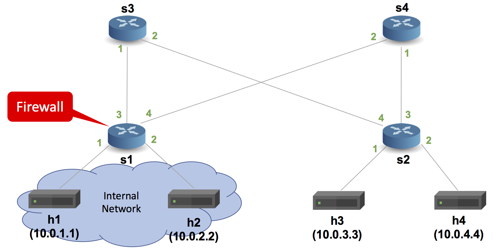

# Implementing A Basic Stateful Firewall

## Introduction

The objective of this exercise is to write a P4 program that
implements a simple stateful firewall. To do this, we will use
a bloom filter. This exercise builds upon the basic exercise
so be sure to complete that one before trying this one.

We will use the pod-topology for this exercise, which consists of
four hosts connected to four switches, which are wired up as they
would be in a single pod of a fat tree topology.



Switch s1 will be configured with a P4 program that implements a
simple stateful firewall (`firewall.p4`), the rest of the switches will run the 
basic IPv4 router program (`basic.p4`) from the previous exercise.

The firewall on s1 should have the following functionality:
* Hosts h1 and h2 are on the internal network and can always
  connect to one another.
* Hosts h1 and h2 can freely connect to h3 and h4 on the
  external network.
* Hosts h3 and h4 can only reply to connections once they have been
  established from either h1 or h2, but cannot initiate new
  connections to hosts on the internal network.

**Note**: This stateful firewall is implemented 100% in the dataplane
using a simple bloom filter. Thus there is some probability of
hash collisions that would let unwanted flows to pass through.

Our P4 program will be written for the V1Model architecture implemented
on P4.org's bmv2 software switch. The architecture file for the V1Model
can be found at: /usr/local/share/p4c/p4include/v1model.p4. This file
desribes the interfaces of the P4 programmable elements in the architecture,
the supported externs, as well as the architecture's standard metadata
fields. We encourage you to take a look at it.

> **Spoiler alert:** There is a reference solution in the `solution`
> sub-directory. Feel free to compare your implementation to the
> reference.

## Step 1: Run the (incomplete) starter code

The directory with this README also contains a skeleton P4 program,
`firewall.p4`. Your job will be to extend this skeleton program to
properly implement the firewall.

Before that, let's compile the incomplete `firewall.p4` and bring
up a switch in Mininet to test its behavior.

1. In your shell, run:
   ```bash
   make run
   ```
   This will:
   * compile `firewall.p4`, and
   * start the pod-topo in Mininet and configure all switches with
   the appropriate P4 program + table entries, and
   * configure all hosts with the commands listed in
   [pod-topo/topology.json](./pod-topo/topology.json)

2. You should now see a Mininet command prompt. Try to run some iperf
   flows between the hosts. Since the firewall is not implemented yet
   the following should work: 
   ```bash
   mininet> iperf h3 h1
   ```
3. Type `exit` to leave each xterm and the Mininet command line.
   Then, to stop mininet:
   ```bash
   make stop
   ```
   And to delete all pcaps, build files, and logs:
   ```bash
   make clean
   ```

### A note about the control plane

A P4 program defines a packet-processing pipeline, but the rules
within each table are inserted by the control plane. When a rule
matches a packet, its action is invoked with parameters supplied by
the control plane as part of the rule.

In this exercise, we have already implemented the the control plane
logic for you. As part of bringing up the Mininet instance, the
`make` command will install packet-processing rules in the tables of
each switch. These are defined in the `sX-runtime.json` files, where
`X` corresponds to the switch number.

**Important:** We use P4Runtime to install the control plane rules. The
content of files `sX-runtime.json` refer to specific names of tables, keys, and
actions, as defined in the P4Info file produced by the compiler (look for the
file `build/firewall.p4.p4info.txt` after executing `make run`). Any changes in the P4
program that add or rename tables, keys, or actions will need to be reflected in
these `sX-runtime.json` files.

## Step 2: Implement Firewall

The `firewall.p4` file contains a skeleton P4 program with key pieces of
logic replaced by `TODO` comments. Your implementation should follow
the structure given in this file---replace each `TODO` with logic
implementing the missing piece.

## Step 3: Run your solution

Follow the instructions from Step 1. This time, the `iperf` flow between
h3 and h1 should be blocked by the firewall.

### Troubleshooting

There are several problems that might manifest as you develop your program:

1. `firewall.p4` might fail to compile. In this case, `make run` will
report the error emitted from the compiler and halt.

2. `firewall.p4` might compile but fail to support the control plane
rules in the `s1-runtime.json` file that `make run` tries to install
using P4Runtime. In this case, `make run` will report errors if control
plane rules cannot be installed. Use these error messages to fix your
`firewall.p4` implementation.

3. `firewall.p4` might compile, and the control plane rules might be
installed, but the switch might not process packets in the desired
way. The `logs/sX.log` files contain detailed logs that describing
how each switch processes each packet. The output is detailed and can
help pinpoint logic errors in your implementation.

#### Cleaning up Mininet

In the latter two cases above, `make run` may leave a Mininet instance
running in the background. Use the following command to clean up
these instances:

```bash
make stop
```

