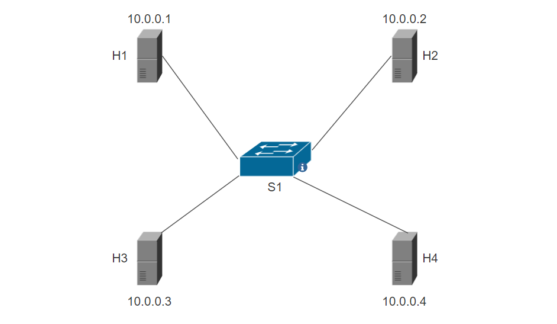

# Implementing Multicast

## Introduction

The objective of this exercise is to write a P4 program that multicasts packets
to a group of ports.


Upon receiving an Ethernet packet, the switch looks up the output port based on
the destination MAC address. If it is a miss, the switch broadcast packets on
ports belonging to a multicast group (if ingress port appears in the group, the
packet will be dropped in the egress pipeline).


Your switch will have a single table, which the control plane will populate with
static rules. Each rule will map an Ethernet MAC address to the output port. We
have already defined the control plane rules, so you only need to implement the
data plane logic of your P4 program.

We will use the star topology for this exercise. It is a single switch that
connects four hosts as follow:



Our P4 program will be written for the V1Model architecture implemented on
P4.org's bmv2 software switch. The architecture file for the V1Model can be
found at: /usr/local/share/p4c/p4include/v1model.p4. This file describes the
interfaces of the P4 programmable elements in the architecture, the supported
externs, as well as the architecture's standard metadata fields. We encourage
you to take a look at it.

> **Spoiler alert:** There is a reference solution in the `solution`
> sub-directory. Feel free to compare your implementation to the
> reference.

## Step 1: Run the (incomplete) starter code

The directory with this README also contains a skeleton P4 program,
`multicast.p4`, which initially drops all packets. Your job will be to extend
this skeleton program to properly forward Ethernet packets.

Before that, let's compile the incomplete `multicast.p4` and bring up a switch
in Mininet to test its behavior.

1. In your shell, run:
   ```bash
   make run
   ```
   This will:
   * compile `multicast.p4`, and
   * start the sig-topo in Mininet and configure all switches with
   the appropriate P4 program + table entries, and
   * configure all hosts with the commands listed in
   [pod-topo/topology.json](./pod-topo/topology.json)

2. You should now see a Mininet command prompt. Try to ping between
   hosts in the topology:
   ```bash
   mininet> h1 ping h2
   mininet> pingall
   ```
3. Type `exit` to leave each xterm and the Mininet command line.
   Then, to stop mininet:
   ```bash
   make stop
   ```
   And to delete all pcaps, build files, and logs:
   ```bash
   make clean
   ```

The ping failed because each switch is programmed according to `multicast.p4`,
which drops all packets on arrival. Your job is to extend this file so it
forwards packets.

### A note about the control plane

A P4 program defines a packet-processing pipeline, but the rules within each
table are inserted by the control plane. When a rule matches a packet, its
action is invoked with parameters supplied by the control plane as part of the
rule.

In this exercise, we have already implemented the control plane logic for you.
As part of bringing up the Mininet instance, the `make run` command will install
packet-processing rules in the tables of each switch. These are defined in the
`sX-runtime.json` files, where `X` corresponds to the switch number.

**Important:** We use P4Runtime to install the control plane rules. The
content of files `sX-runtime.json` refer to specific names of tables, keys, and
actions, as defined in the P4Info file produced by the compiler (look for the
file `build/basic.p4.p4info.txt` after executing `make run`). Any changes in the P4
program that add or rename tables, keys, or actions will need to be reflected in
these `sX-runtime.json` files.

## Step 2: Implement L2 Multicast

The `multicast.p4` file contains a skeleton P4 program with key pieces of logic
replaced by `TODO` comments. Your implementation should follow the structure
given in this file---replace each `TODO` with logic implementing the missing
piece.

A complete `multicast.p4` will contain the following components:

1. Header type definitions for Ethernet (`ethernet_t`)
2. An action to drop a packet, using `mark_to_drop()`.
3. **TODO:** An action (called `multicast`) that sends multiple copies of packets
   to a group of output ports.
4. **TODO:** Add the `multicast` action to the list of available actions
5. **TODO:** Set `multicast` as default action for table `mac_lookup`

## Step 3: Run your solution

Follow the instructions from Step 1. This time, you should be able to
successfully ping between `h1`, `h2` and `h3` but not `h4` in the topology.

6. **TODO:** Add port 4 to the multicast group in file `sig-topo/s1-runtime.json`

### Food for thought

Other questions to consider:
 - How would you enhance your program to respond to ARP requests?
 - How would you enhance your program to support MAC learning from the controller?

### Troubleshooting

There are several problems that might manifest as you develop your program:

1. `multicast.p4` might fail to compile. In this case, `make run` will
report the error emitted from the compiler and halt.

2. `multicast.p4` might compile but fail to support the control plane rules in
the `s1-runtime.json` file that `make run` tries to install using P4Runtime. In
this case, `make run` will report errors if control plane rules cannot be
installed. Use these error messages to fix your `multicast.p4` implementation.

3. `multicast.p4` might compile, and the control plane rules might be installed,
but the switch might not process packets in the desired way. The `logs/sX.log`
files contain detailed logs that describing how each switch processes each
packet. The output is detailed and can help pinpoint logic errors in your
implementation.

#### Cleaning up Mininet

In the latter two cases above, `make run` may leave a Mininet instance
running in the background. Use the following command to clean up
these instances:

```bash
make stop
```

## Next Steps

Congratulations, your implementation works! Move on to [Firewall](../firewall).


## Relevant Documentation

The documentation for P4_16 and P4Runtime is available [here](https://p4.org/specs/)

All excercises in this repository use the v1model architecture, the documentation for which is available at:
1. The BMv2 Simple Switch target document accessible [here](https://github.com/p4lang/behavioral-model/blob/master/docs/simple_switch.md) talks mainly about the v1model architecture.
2. The include file `v1model.p4` has extensive comments and can be accessed [here](https://github.com/p4lang/p4c/blob/master/p4include/v1model.p4).