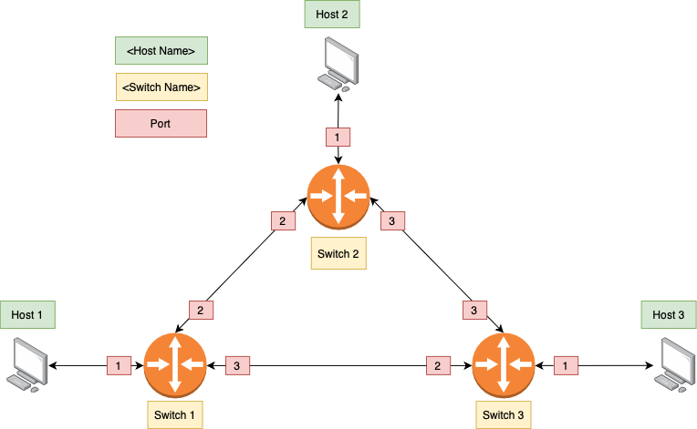
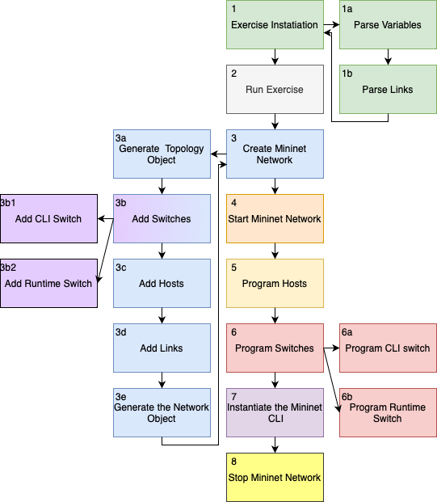
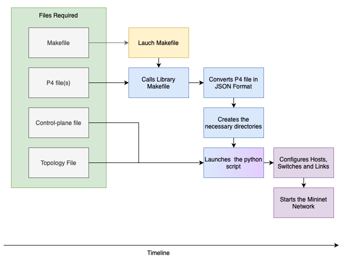

# P4 Utils

This folder contains various scripts used to run the code.

## Table of contents
- [P4 Utils](#p4-utils)
  - [Table of contents](#table-of-contents)
  - [Mininet](#mininet)
  - [Python-Mininet](#python-mininet)
  - [Mininet and P4](#mininet-and-p4)
  - [BMv2 Architecture](#bmv2-architecture)
  - [Simulation Files](#simulation-files)
    - [P4 File](#p4-file)
    - [The Control-Plane file](#the-control-plane-file)
    - [Topology File](#topology-file)
    - [Mininet Python Script File](#mininet-python-script-file)
      - [Exercise Instantiation](#exercise-instantiation)
      - [Running the Exercise](#running-the-exercise)
      - [Creating the Mininet Network](#creating-the-mininet-network)
      - [Starting the Mininet Network](#starting-the-mininet-network)
      - [Programming the Hosts](#programming-the-hosts)
      - [Programming the Switches](#programming-the-switches)
      - [Instantiating the Mininet CLI](#instantiating-the-mininet-cli)
      - [Stopping the Mininet Network](#stopping-the-mininet-network)
      - [Other Notes](#other-notes)
        - [Switch Abstraction](#switch-abstraction)
        - [Default Switch](#default-switch)
    - [Makefile](#makefile)
  - [Wrap-up](#wrap-up)


 ## Mininet
Originally created by Bob Lantz, [Mininet](https://github.com/mininet/mininet) is a very complete network emulation tool. Using Mininet, a user can quickly deploy a full network in minutes. As mentioned in [Oliveira et al.](https://ieeexplore.ieee.org/document/6860404), "the possibility of sharing results and tools at zero cost are positive factors that help scientists to boost their researches despite the limitations of the tool in relation to the performance fidelity between the simulated and the real environment."

Some drawbacks of Mininet include line-rate fidelity and processing power, which are only of limited relevancy given the purpose of the technology. Mininet, much like P4, is supported by the [ONF](https://opennetworking.org/), ensuring its long-term support.

## Python-Mininet
Mininet supports both python2 and python3 through its [API](http://mininet.org/api/annotated.html). Since python2 is no longer officially supported, all python scripts are using python3.

By using this API, networks can be instantiated from a python script, speeding up the initialization process. Most Mininet abstractions are also usable from within the python API:
*  Links, such as OVSLink or the TCLink;
*  Switches, such as the OVSSwitch, IVSSwitch, and P4Switch;
*  Controllers, such as NOX, OVS, or Ryu;
*  NAT and Linux bridges;

## Mininet and P4
To abstract a P4-enabled switch, the [P4Runtime](https://pypi.org/project/p4runtime/) library is used. Using the _P4RuntimeSwitch_ abstraction, the switch can be emulated within Mininet.

## BMv2 Architecture
Several architectures are supported by P4. Since most are closed-source, Mininet only supports a smaller subset.[BMv2](https://github.com/p4lang/behavioral-model) is an openly available implementation of the P4 Switch, using C++11. It makes use of JSON format files (which are compiled using the provided P4 compiler (p4c)) to generate switch behavior. The BMv2 behavioral model supports [several different versions](https://github.com/p4lang/behavioral-model/tree/main/targets) (also known as targets):

* **simple_switch**. The main target for the software switch. Can execute most P4$_{14}$ and P4$_{16}$ programs. Uses the v1model architecture and can run on most general-purpose CPUs.
* **simple_switch_grpc**. Based on the simple switch, but with support for TCP connections GRPC from a controller (uses the P4 Runtime API).
* **psa_switch**. Based on the simple switch, but instead of using the v1model architecture, uses the more recent Portable Switch Architecture (PSA). <u> Note </u>: the psa_switch implementation is incomplete, and many P4 programs will either not compile succcessfully, or not simulate correctly when executed using psa_switch.
* **simple_router and l2_switch**. Implemented as a proof of concept and largely incomplete. Should not be used over the *simple_switch*.


## Simulation Files
Before executing, the following files are required:

* **P4 file(s)**. Defines the behavior of the switch(es).
* **Control plane P4 file(s)**. Provides the entries used to fill the data plane tables (inserted by the control plane).
* **Topology file**. Describes the network topology, connections, switches, and hosts.
* **Makefile**. Automates network generation process.

### P4 File
The P4 file defines the data-plane behavior and it is stored directly in the switch. Its structure is fixed while the switch is running, only allowing modifications to entries of its tables.

An example of a simple P4 program can be found [here](../exercises/basic/solution/basic.p4).

This program contains 4 stages: 
* Parser; 
* Ingress; 
* Egress; 
* Deparser. 

Its functionality includes: setting the *egress.port*, decrementing the TTL, and changing the source and destination IPs. 


### The Control-Plane file
The control-plane file uses JSON format and completes the data-plane file, inserting entries corresponding to the respective data-plane tables. For example, entries for the corresponding ipv4_lpm table are filled in this file. Such tables are filled at startup.


The code block below illustrates a sample of the control-plane file(full file [here](../exercises/basic/triangle-topo/s1-runtime.json)). For each entry for a given table, 4 pieces of information can be modified:

* **table**. Defines to which table the entry corresponds.
* **match**. Defines the matching criteria.
* **action_name**. Defines which action is taken in a successful match. 
* **action_params**. Defines the value for the action parameters.


**Note**: Each parameter should match its respective data-plane counterpart, meaning that for an entry to be inserted, then a table must exist, for an action to be called it must be defined in the data-plane.

In the example, since there is only one table in the data-plane counterpart, all entries are defined for said table. Its behavior can be described as: for any given IP (key), the switch performs the *MyIngress.ipv4\_forward* action, which sets both the *dstAddress* and *Port*.

```json
{
  "target": "bmv2",
  "p4info": "build/basic.p4.p4info.txt",
  "bmv2_json": "build/basic.json",
  "table_entries": [
    {
      "table": "MyIngress.ipv4_lpm",
      "match": {
        "hdr.ipv4.dstAddr": ["10.0.1.1", 32]
      },
      "action_name": "MyIngress.ipv4_forward",
      "action_params": {
        "dstAddr": "08:00:00:00:01:11",
        "port": 1
      }
    }
  ]
}
```

### Topology File
The topology file uses JSON format and contains information regarding the network and its composition. For a simple triangle topology (as used in the tutorials), the topology file takes the format depicted below


 
```json
{
"hosts": {
"h1": {"ip": "10.0.1.1/24", "mac": "08:00:00:00:01:11",
       "commands":["route add default gw 10.0.1.10 dev eth0",
                   "arp -i eth0 -s 10.0.1.10 08:00:00:00:01:00"]},
"h2": {"ip": "10.0.2.2/24", "mac": "08:00:00:00:02:22",
       "commands":["route add default gw 10.0.2.20 dev eth0",
                   "arp -i eth0 -s 10.0.2.20 08:00:00:00:02:00"]},
"h3": {"ip": "10.0.3.3/24", "mac": "08:00:00:00:03:33",
       "commands":["route add default gw 10.0.3.30 dev eth0",
                   "arp -i eth0 -s 10.0.3.30 08:00:00:00:03:00"]}
},
"switches": {
    "s1": { "runtime_json" : "triangle-topo/s1-runtime.json" },
    "s2": { "runtime_json" : "triangle-topo/s2-runtime.json" },
    "s3": { "runtime_json" : "triangle-topo/s3-runtime.json" }
},
"links": [
    ["h1", "s1-p1"], ["s1-p2", "s2-p2"], ["s1-p3", "s3-p2"],
    ["s3-p3", "s2-p3"], ["h2", "s2-p1"], ["h3", "s3-p1"]
]
}
```

In this file, the following elements are defined:

* **Hosts**. Defines the hosts instantiated by Mininet. Parameters such as IP, MAC address and, startup commands are also defined in this section. In the example, the commands used are:

    * *route add*, which adds a static route to the default gateway (the switch).
    * *arp*, which manipulates the sytem ARP scache (adds an entry for the switch's MAC address).
* **Switches**. Defines switch behavior. Two parameters can be inserted here:
    
    * *program*. Defines the program inserted into the switch (data plane). <u>Note</u>: If this parameter is not set, then the execution assumes the default P4 file (passed on startup).
    * *runtime_json*. Defines the path for the control plane file.
    
* **links**. Defines the links between network nodes. The following list format is used: 
    ```[Node1, Node2, Latency, Bandwidth]```, where nodes can be defined as ```<Hostname>```, for hosts, and ```<SwitchName>-<SwitchPort>``` for switches. Both *latency* and *bandwidth* are optional, where *latency* is an integer defined in milliseconds(ms) and *bandwidth* is a float defined in megabits per second (Mb/s).

**Note**: IPs need not be attributed to switches, as they make use of the [Linux Networking Stack](https://github.com/mininet/mininet/wiki/FAQ#assign-macs).

### Mininet Python Script File
 The most intricate piece of code is the python file. Its goal is to guide the execution, using the files mentioned before, such that a network is established without having to manually set it up. The file is found [here](./run_exercise.py).
 
The figure below presents an infographic chart of the program's flow of execution. To understand the chart, it should be read in numerical order where **3a** occurs after **3** but before **4**. Instead of a single line of execution, the chart was created in such a way that it alludes to the different methods present in the code, bearing resemblance to the underlying code structure.



The following subsections analyze the different stages of execution (1 to 8) represented in the infographic. 


1. [Exercise Instantiation](#exercise-instantiation)<!-- no toc --> 
2. [Running the Exercise](#running-the-exercise)
3. [Creating the Mininet Network](#creating-the-mininet-network)
4. [Starting the Mininet Network](#starting-the-mininet-network)
5. [Programming the Hosts](#programming-the-hosts)
6. [Programming the Switches](#programming-the-switches)
7. [Instantiating the Mininet CLI](#instantiating-the-mininet-cli)
8. [Stopping the Mininet Network](#stopping-the-mininet-network)


#### Exercise Instantiation
The initializer intakes the arguments passed by execution and performs an initial formal parsing. Most notably it converts the links from the given ```<Node>-<Node>``` format to a python dictionary. This dictionary is shown below contains the 4 elements mentioned in topology file.

```python
link_dict = {'node1':s,
             'node2':t,
             'latency':'0ms',
             'bandwidth':None
            }
```

#### Running the Exercise
The class *Exercise* is created to help manage all data and manage the execution flow. The code below  describes the *run_exercise()* method. Lines 4 and 5 create the network. Lines 9 and 10 program the network elements. Line 15 launches the user interface.

```python
#(... Omitted ...)#
def run_exercise(self):
# Initialize mininet with the topology specified by the config
    self.create_network()
    self.net.start()
    sleep(1)

    # some programming that must happen after the net has started
    self.program_hosts()
    self.program_switches()

    # wait for that to finish. Not sure how to do this better
    sleep(1)

    self.do_net_cli()
    # stop right after the CLI is exited
    self.net.stop()
#(... Omitted ...)#
```

#### Creating the Mininet Network

It is in this stage that switches, links, and hosts are added to the network. To instantiate the network object, a class, *ExerciseTopo*, is used. This class inherits from the *Topo Class* native to Mininet. The code below shows the initialization process of the *ExerciseTopo* class.

```python
#(... Omitted ...)#
self.topo = ExerciseTopo(self.hosts, self.switches, self.links, self.log_dir, self.bmv2_exe, self.pcap_dir)

class ExerciseTopo(Topo):
    """ The mininet topology class for the P4 tutorial exercises.
    """
    def __init__(self, hosts, switches, links, log_dir, bmv2_exe, pcap_dir, **opts):
        Topo.__init__(self, **opts)
        host_links = []
        switch_links = []
  #(... Omitted ...)#
```

Below is shown how the switches are configured. The method *configureP4Switch* creates the switch using *simple_switch_grpc*.

If no program is specified, the switch follows the default implementation.

```python
#(... Omitted ...)#
for sw, params in switches.items():
    if "program" in params:
        switchClass = configureP4Switch(
                sw_path=bmv2_exe,
                json_path=params["program"],
                log_console=True,
                pcap_dump=pcap_dir)
    else:
        # add default switch
        switchClass = None
    self.addSwitch(sw, log_file="%s/%s.log" %(log_dir, sw), cls=switchClass)
#(... Omitted ...)
```

The penultimate step is to generate the hosts and the host-to-switch links. Using the information provided in the [topology file](#topology-file) and the methods *addHost* and *addLink*, configurations are directly translated to the Mininet Network.


```python
#(... Omitted ...)
for link in host_links:
    host_name = link['node1']
    sw_name, sw_port = self.parse_switch_node(link['node2'])
    host_ip = hosts[host_name]['ip']
    host_mac = hosts[host_name]['mac']
    self.addHost(host_name, ip=host_ip, mac=host_mac)
    self.addLink(host_name, sw_name,
                 delay=link['latency'], bw=link['bandwidth'],
                 port2=sw_port)
#(... Omitted ...)
```


Finally, the links between the switches are added. Using the data structure dictionary described in [here](#exercise-instantiation), a parsing method splits the switch name and port, creating links based on such properties.


```python
#(... Omitted ...)
for link in switch_links:
    sw1_name, sw1_port = self.parse_switch_node(link['node1'])
    sw2_name, sw2_port = self.parse_switch_node(link['node2'])
    self.addLink(sw1_name, sw2_name,
                port1=sw1_port, port2=sw2_port,
                delay=link['latency'], bw=link['bandwidth'])
#(... Omitted ...)
```

#### Starting the Mininet Network
Starting the Mininet network can be achieved by using the *start* method of the *network* object. In the example, the line of code is ```self.net.start()```.

#### Programming the Hosts
After starting the network, runtime commands are executed. Below it is demonstrated how console commands are applied to the hosts created in the network. First, the host is retrieved from the network (using its name as key) and then, using the method ```<host>.cmd(<command>)```, commands are executed.

```python
#(... Omitted ...)#
def program_hosts(self):
    for host_name, host_info in list(self.hosts.items()):
        h = self.net.get(host_name)
        if "commands" in host_info:
            for cmd in host_info["commands"]:
                h.cmd(cmd)
#(... Omitted ...)#
```

#### Programming the Switches
Much like the hosts, the switches also have a runtime counterpart. The method *program_switches* configures switches specifically for simple_switch_grpc, utilizing the [control plane file](#the-control-plane-file) for its configuration.

```python
def program_switch_p4runtime(self, sw_name, sw_dict):
    sw_obj = self.net.get(sw_name)
    grpc_port = sw_obj.grpc_port
    device_id = sw_obj.device_id
    runtime_json = sw_dict['runtime_json']
    self.logger('Configuring switch %s using P4Runtime with file %s' % (sw_name, runtime_json))
    with open(runtime_json, 'r') as sw_conf_file:
        outfile = '%s/%s-p4runtime-requests.txt' %(self.log_dir, sw_name)
        p4runtime_lib.simple_controller.program_switch(
            addr='127.0.0.1:%d' % grpc_port,
            device_id=device_id,
            sw_conf_file=sw_conf_file,
            workdir=os.getcwd(),
            proto_dump_fpath=outfile,
            runtime_json=runtime_json
        )
#(... Omitted ...)#
```


#### Instantiating the Mininet CLI
The final step of execution is presenting the user with a interface. This tool is called the "Mininet CLI" and lets the user perform several operations in the network (such as ping hosts, instantiating command lines inside the switches, etc). Using the *do_net_cli()* method, a console is instantiated, which first prints information about the network and then calls the *Mininet CLI*.

```python
def do_net_cli(self):
    #(... Omitted ...)#
    print('===============================================')
    print('Welcome to the BMV2 Mininet CLI!')
    print('===============================================')
    print('Your P4 program is installed into the BMV2 software switch')
    print('and your initial runtime configuration is loaded. You can interact')
    print('with the network using the mininet CLI below.')
    print('')
    #(... Omitted ...)#
    CLI(self.net)
```


#### Stopping the Mininet Network
Stopping the Mininet network is similar to starting, it can be achieved by calling the ```self.net.stop()```.

#### Other Notes
##### Switch Abstraction

There might be some confusion regarding the origin of the *P4RuntimeSwitch* class. This class materializes via library import (and is present in this [file](./p4runtime_switch.py)). The process is shown below.

```python
from p4_mininet import P4Host, P4Switch
from p4runtime_switch import P4RuntimeSwitch
```

##### Default Switch

As mentioned previously, if no program is provided, the default switch is used instead. The code for the default swich is shown below and is largely similar to the program-enabled one. The key difference lies the program running inside the switch, which is passed by argument to the script.

```python
defaultSwitchClass = configureP4Switch(
                                sw_path=self.bmv2_exe,
                                json_path=self.switch_json,
                                log_console=True,
                                pcap_dump=self.pcap_dir)
```

### Makefile
 
<u>Make</u> is a very useful tool when it comes to automation. A Makefile is used by the Make utility for configuration. This repository using 2 Makefiles per exercise. The [main makefile](./Makefile) makes most of the "heavy lifting", while the "secondary" Makefile contains a few exercise specific variable (such as topology file and default program.)

The main Makefile has 3 modes of execution:

* **run**. Build and runs the main program.
* **stop**. Stops the execution of the current Mininet network.
* **clean**. First calls stop, then cleans all files generated by execution.


Both **stop** and **clean** are straightforward. **Stop** calls the Mininet command to stop the network ```sudo mn -c```, while clean additionally removes all execution files using ```rm -f *.pcap``` and ```rm -rf \$(BUILD\_DIR) \$(PCAP\_DIR) \$(LOG\_DIR)```.

As for **run**, follows the steps mentioned below:

* Creates all the directories needed for execution: build, pcap, and log directories.
* Convert all .p4 files into JSON files using the P4c utility. These files are placed in the build directory.
* Runs the python script using the following arguments: topology file (topology.json by default); p4 program and switch architecture.

A sample "secondary" makefile is shown below, this file uses the "main" makefile, modifiying some variables required for execution.

```bash
BMV2_SWITCH_EXE = simple_switch_grpc
TOPO = pod-topo/topology.json

include ../../utils/Makefile
```

## Wrap-up
To conclude, the figure below detais all necessary steps and files to run a simulation.


